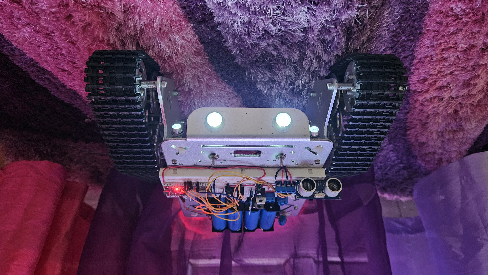

<div align="center">

# ESP32-Tank: Modular, Network-Controlled DIY Tank

**main:**   | **dev:**  

</div>

---

## 🚀 Overview



An advanced implementation of the [ESP32-Tank](https://github.com/SavageBeef/ESP32-Tank) project, refactored into a **test-driven, modular C++ architecture** using the **PlatformIO** ecosystem.

The project decouples hardware-specific code from core control logic, allowing the tank's "brain" to be simulated, tested, and verified entirely in a native host environment.

---

## 🛡️ Key Features & Safety Guards

### 1. Refactored Movement Logic (`TankDrive.cpp`)
The movement engine is a standalone module, enabling rigorous testing of the tank's behavior away from the physical chassis.
* **State-Machine Control:** Explicitly tracks `STATE_FWD`, `STATE_BWD`, `STATE_STOP`, `STATE_HALTED`, and `STATE_GUARD`.
* **Directional Lock Guard:** A hardware-safety feature that prevents motor drivers from instant polarity flips (e.g., Forward directly to Backward) without passing through a neutral zone, protecting the H-bridge and gearboxes.
* **Obstacle Intelligence:** Automated `STATE_HALTED` transition triggered by real-time ultrasonic sensor feedback.

### 2. Calibrated Battery Telemetry (`BatteryMath.h`)
Utilizes a voltage divider formula with custom calibration constants. Features automatic percentage clamping (0–100%) to provide reliable telemetry to the control interface.

### 3. Migrated Network Logic (`NetworkHelper.cpp`)
The Captive Portal and other network-related code have been decoupled to simplify the [`main.cpp`](src/ESP32_WiFi_Tank.cpp) file. The main file handles the high-level execution order, while underlying libraries manage the implementation details.

---

## 🏛️ Architecture & QA

### 🐦‍🔥 The Transition to PlatformIO
Originally developed as a single Arduino sketch (`.ino`) with loose header files (`.h`), this project was re-engineered to scale gracefully:
* **Decoupled Logic:** Movement calculations and battery math reside in standalone classes, allowing them to be compiled and tested on a PC without ESP32 hardware.
* **Dependency Management:** Explicit library handling (Blynk, WebSerial, etc.) ensures consistent, reproducible builds across different development environments.
* **CI/CD Readiness:** Integrated with **GitHub Actions** to automatically validate every commit against unit tests for movement logic and safety guards.

### 🧪 Unit Testing & Quality Assurance
The project includes a comprehensive test suite located in the `test/` directory using the **Unity** testing framework.
* **Native Testing:** Allows for "Logic-Only" testing by simulating joystick coordinates (X, Y) on the host machine to verify expected PWM outputs and state transitions.
* **Regression Prevention:** Automated tests ensure that updates to dead-zones or speed mapping never compromise the **Directional Lock Guard** or obstacle avoidance logic.

## 🏗️ System Diagrams

### Block Diagram


### Schematic Diagram


---

## 📋 Hardware Specifications

### 🔨 Components List

| Component Reference | Description |
| :--- | :--- |
| **Chassis** | DIY T300 NodeMCU Aluminum Alloy Metal Wall-E Tank Track Caterpillar Chassis Smart Robot Kit |
| **IC2** (Microcontroller) | KeeYees ESP-WROOM-32 (NodeMCU-32S) (38 PIN Narrow version) |
| **IC1** (Motor Driver) | L293D Motor Driver IC |
| **M1 & M2** (Motors) | ComXim 25GA370 High Torque DC Brush Motor 25mm All Metal Gear (12V, 100R) |
| **S1 & S2** (Switches) | Gikfun MTS102 2 Position 3 Pins Mini Toggle Switch for Arduino |
| **U1 & U2** (Regulators) | STMicroelectronics L7805CV TO-220 Voltage Regulator |
| **C1 & C2** (Capacitors) | 10 µF Electrolytic Capacitor |
| **R1 & R2** (Resistors) | 220 Ohms Resistor |
| **Q1** (Transistor) | PN 2222A NPN Transistor |
| **Q2** (Transistor) | S8050 NPN Transistor |
| **hc-sr1** (Sensor) | HC-SR04 Ultrasonic Sensor |
| **R3 - R8** (Resistors) | For a voltage divider where R2 = **R3** (10k Ohms) and R1 = sum of **R4 - R8** (42k Ohms) |

### 🔋 Power Source Configuration

The theoretical power design utilizes **eight 18650 Li-ion batteries** configured as **2-Parallel, 4-Series (2P4S)** to maximize current capacity and runtime.

| Battery Type | Nominal Voltage | Quantity | Configuration |
| :--- | :--- | :--- | :--- |
| **18650 Li-ion** | 3.7 V | 8 | 2P4S (Target) / 4S (Current) |

#### Output Voltage and Current (2P4S Design)
* **Nominal Output Voltage (Series):** 4 cells × 3.7 V = **14.8 V**
* **Maximum Output Voltage (Fully Charged):** 4 cells × 4.2 V ≈ **16.8 V**

This provides optimal voltage for the **ComXim 25GA370 DC Brush Motors** (12V rated), ensuring high performance without significant voltage drops under heavy load.

> [!NOTE] 
> **Current Physical Setup:** The physical tank build currently uses a **4-Series (4S)** configuration using dedicated 18650 battery holders. The original `TP4056` charging modules have been replaced by an external `XTAR VC8S` battery charger. This 4S setup yields approximately 1 hour of continuous runtime.

---

## 💻 Development & Software Environment

### PlatformIO IDE
* **IDE Version:** PlatformIO IDE v3.3.4
* **Core Configuration:** Boards, libraries, and core dependencies are strictly defined within the [`platformio.ini`](platformio.ini) file.

### Tooling & Libraries

**Boards Manager:**
* `esp32` by Espressif Systems - v3.2.0 (A.K.A. v54.03.20)

**Libraries & Plugins:**

| Library / Plugin Name | Author | Version | Description |
| :--- | :--- | :--- | :--- |
| **Blynk** | Volodymyr Shymanskyy | 0.6.7 | IoT Cloud platform connection |
| **ArduinoOTA** | Arduino, Juraj Andrassy | 1.1.0 | Over-the-air firmware updates |
| **WebSerial** | Ayush Sharma | 2.1.1 | Remote serial logging via web |
| **ESP Async WebServer** | ESP32Async | 3.9.0 | Asynchronous HTTP server engine |
| **Async TCP** | ESP32Async | 3.4.9 | Underlying TCP library for webserver |
| **SR04** | Elegoo | - | HC-SR04 ultrasonic sensor driver |
| **WiFiManager** | tzapu | 2.0.0 | Captive portal network provisioning |
| **arduino-littlefs-upload** | earlephilhower | 1.6.3 | Filesystem upload plugin for data folder |

---

## 📱 Blynk Control Setup

### 💻 Local Server Installation
This project connects to a local self-hosted Blynk server. Source code can be found at [blynk-server](https://github.com/Peterkn2001/blynk-server).

#### Option 1: Native Script Execution
1.  Download the configuration scripts: **[blynk-configs](https://github.com/SavageBeef/blynk-configs)**.
2.  Place the scripts into the **same directory** as your local `server-0.41.17.jar` file.
3.  Execute the script to launch the server environment.

#### Option 2: Docker Container (Recommended)
Uses the multi-arch [`hokori/blynk-server:0.41.17`](https://hub.docker.com/r/hokori/blynk-server) image (supports x64 and ARM).

1.  **Prerequisites:** Install **Docker** and **Docker Compose**.
2.  **Configuration:** Fetch the `docker-compose.yml` boilerplate from **[blynk-configs](https://github.com/SavageBeef/blynk-configs)** and adjust your environment variables.
3.  **Deployment Commands:**
    ```bash
    # Start server in background
    docker-compose up -d

    # Stop and dismantle server container
    docker-compose down
    ```

### 📱 Mobile App Interface
* **Blynk App Version:** 2.27.34

| Virtual Pins Mapping | Control UI Live View |
| :---: | :---: |
|  |  |

### 🔧 Local Server Configuration

Because this project utilizes a legacy Blynk local server, provisioning accounts and routing your mobile app requires a few specific steps that differ from modern Blynk Cloud workflows.

#### Step 1: Create a Local User Account
Before your phone or the ESP32 can connect, an account must exist on your local server.

1. Open your browser and navigate to the Blynk Administration Panel: `https://YOUR_SERVER_IP:9443/admin`
   * *Note: You may need to bypass the browser's SSL/TLS safety warning since the local server uses a self-signed certificate.*
2. Log in using your admin credentials (default is `admin@blynk.cc` / `admin`).
3. Navigate to the **Users** tab and click **Add New User**. 
4. Input an email and password. This will be the profile you use to log into the mobile app.

Note: Alternative steps can be found [here](https://github.com/SavageBeef/blynk-configs#%EF%B8%8F-manual-user-creation).

#### Step 2: Configure the Mobile App Connection
To redirect the legacy Blynk App (v2.27.34) away from default cloud servers to your machine:

1. Launch the Blynk app on your phone.
2. On the login screen, tap **Log In** (do not select Create New Account).
3. Tap the **Traffic Light / Server Icon** located right below the password field.
4. Slide the toggle from **Blynk** over to **Custom**.
5. Enter your local server's IP address and set the port to **9443** (or your mapped SSL port).
6. Return to the login page and sign in using the user credentials you created in Step 1.

#### Step 3: Extract the Authentication Token
1. Once logged in, open or create your Tank Control project workspace.
2. Tap the **Nut/Gear Icon** in the top right corner to access **Project Settings**.
3. Scroll down to the **Devices** section, select your ESP32 device, and tap **Auth Token**.
4. Tap **E-mail** to send it to your inbox or tap to copy it directly to your clipboard.

### 🌐 Connecting via the Tank Captive Portal

If the tank cannot establish a connection, it will drop into a localized provisioning state so you don't have to hardcode passwords or secrets.

#### Full Wi-Fi & Blynk Setup
Launches if the tank cannot find its saved home network.

```text
SSID:     Tank-Setup
Password: password123
IP:       192.168.4.1
```

#### Blynk-Only Setup
Launches if the tank find its saved home network but the Blynk credentials fail (or your local server is offline).

```text
SSID:     Tank-Blynk-Setup
Password: password123
IP:       192.168.4.1
```

1. Power on the tank and open your phone's Wi-Fi settings.
2. Connect to the **`Tank-Setup`** access point using the password `password123`.
3. If a captive portal window does not automatically pop up, open your web browser and navigate to `http://192.168.4.1`.
4. In the configuration web form, input:
   * **Wi-Fi SSID & Password:** Your home network credentials.
   * **Blynk Port:** Set this to **8080** (the standard non-SSL hardware port for local Blynk legacy servers).
   * **Blynk Auth Token:** Paste the string token extracted from Step 3 of the app setup.
5. Click **Save**. The ESP32 will commit these parameters to its non-volatile `Preferences` memory and reboot to connect directly to your network.

---

## 🛠️ Flash & Deployment

Follow these steps to clone the workspace, build the binary, and upload the code directly to your hardware using **PlatformIO**.

### Prerequisites
1. Install **VS Code** along with the **PlatformIO IDE** extension.
2. Install **Git** on your development machine.

### Step 1: Clone the Repository
Open a terminal window on your machine and clone the codebase:
```bash
# Clone this repository
git clone https://github.com/SavageBeef/ESP32-Tank-PlatformIO.git

# Move into the project directory
cd ESP32-Tank-PlatformIO
```

Then, open **VS Code**, click **File > Open Folder**, and select the `ESP32-Tank-PlatformIO` project folder. PlatformIO will automatically initialize the workspace and start downloading the specified framework and library dependencies in the background.

### Step 2: Build and Run Local Tests (Optional)

Before flashing the hardware, verify that the core movement calculations pass local unit tests:
1. Click the PlatformIO Ant Icon on the left menu bar.
2. Under the native environment tab, click Test.
3. Alternatively, execute via terminal:

```bash
# Could add the -v for verbose info
pio test -e native
```

### Step 3: Flash Firmware and Filesystem

1. Connect your ESP32 to your PC using a high-quality data-capable Micro-USB or USB-C cable.
2. Click the PlatformIO Ant Icon on the left menu bar and locate the nodemcu-32s target.
3. Upload the Firmware Binary: Under General Tasks, click Upload (or click the → Arrow Icon on the VS Code status bar) to build and flash the application code.
4. Upload the Filesystem Image: Under the Platform Tasks dropdown, click Upload Filesystem Image to compile and flash the data/ assets directory using LittleFS.

Alternatively, run these operations directly from the terminal:
```bash
# Build and upload code firmware
pio run --target upload -e nodemcu-32s

# Build and upload LittleFS filesystem data image
pio run --target uploadfs -e nodemcu-32s
```

---

## 🚧 Future Development / To-Do List

### ⚙️ Tank Control Logic
* [x] **Ultrasonic Sensor Optimization:** Stop tank at obstacles and ignore continued forward stick input until a manual safety clearance check resets it. ([`0412ced`](https://github.com/SavageBeef/ESP32-Tank/commit/0412ced1019b2e85aa10e8bf287e56d3dd1e1c23))
* [x] **Optimize Speed Slider Sensitivity:** Mapped structural input slider ranges directly to dynamic motor PWM limits to bypass the physical dead-zone (0-750). ([`4c2c6b1`](https://github.com/SavageBeef/ESP32-Tank/commit/4c2c6b1081278c5ccd0cd4174da5427822565486))
* [x] **Implement Dual-Mode Turning (Soft & Hard):** Introduced differential wide turns at speed alongside sharp on-the-spot pivot turns at zero throttle. ([`a0f3a01`](https://github.com/SavageBeef/ESP32-Tank/commit/a0f3a01f58bbff9ed59f0d5cbbd16faba97a114c), [`9b06988`](https://github.com/SavageBeef/ESP32-Tank/commit/9b069881c559e9dc7d497c702f9e7d618b88abb4))

### 📱 Blynk App Integration
* [x] **Battery Life Telemetry:** Transmit real-time voltage/percentage mappings over virtual pins to the UI. ([`4fa2a0d`](https://github.com/SavageBeef/ESP32-Tank/commit/4fa2a0db8150598015da4d4c1dc8b0fdf28ded42))
* [x] **Distance Feedback:** Continuous distance updates using HC-SR04 telemetry displayed right on the dashboard UI. ([`1a86019`](https://github.com/SavageBeef/ESP32-Tank/commit/1a86019a34868218a9e55ddc37525fbe77eed8e1))
* [x] **Custom Sensor Limit:** Added a numeric entry box to dynamically scale safety-brake distance tolerances on the fly. ([`fa8743b`](https://github.com/SavageBeef/ESP32-Tank/commit/fa8743b2416cef666430fe2d0306312941814d07))

### 💻 Development Environment / Utility
* [x] **Custom Serial Wrapper:** Implemented simultaneous `dualPrint()` / `dualPrintln()` abstractions mirroring logs to local Hardware Serial and WebSerial tunnels. ([`7b2f663`](https://github.com/SavageBeef/ESP32-Tank/commit/7b2f663f4e958d80c948881af8dee6b58300c08f), [`731f6c9`](https://github.com/SavageBeef/ESP32-Tank/commit/731f6c9ff5fa201b73b6f177cf589acf51a3baca), [`1e4c11e`](https://github.com/SavageBeef/ESP32-Tank/commit/1e4c11e764a6946d85a6ee605c938358414fb7d8))

### 🌐 Network Management (Captive Portal)
* [x] **Wi-Fi Provisioning Webpage:** Implement a captive portal or a simple webpage that launches when the tank fails to connect to the configured network credentials. ([`141e742`](https://github.com/SavageBeef/ESP32-Tank/commit/141e7425c4e670193565e8a104879f825c3bfaf1))
    * This page should allow the user to enter new Wi-Fi credentials (SSID, Password), Blynk Port, and the Blynk Auth Token.
    * The new credentials must be saved to the ESP32's **EEPROM/Flash (Preferences)** to persist across reboots. 

### 📺 Multimedia & Telepresence 🆕
* [ ] **Hardware Upgrade:** Swap standard ESP32-WROOM node out for a PSRAM-enabled variant (e.g., ESP32-CAM or WROVER-E) capable of processing video frame buffers.
* [ ] **Camera Module Integration (FPV):** Add an OV2640 sensor configuration streaming an MJPEG payload alongside real-time telemetries.
* [ ] **Audio Integration (Two-Way Communication):** Adapt localized I2S microphone/speaker audio logic pipelines to facilitate real-time telepresence capability.

### 🚀 CI/CD & Automation 🆕
* [x] **Automated Quality Assurance Pipeline:** Integrated GitHub Actions to automatically run native Unity engine test suites on every remote commit, preventing logic regressions. ([`ef3f031`](https://github.com/SavageBeef/ESP32-Tank-PlatformIO/commit/ef3f03152b3ed491a9d9cda7ae9e7b26cb034a05))
* [x] **Automated Firmware Compilation:** Configured CI workflows to verify successful PlatformIO compilation across standard branch updates. ([`ef3f031`](https://github.com/SavageBeef/ESP32-Tank-PlatformIO/commit/ef3f03152b3ed491a9d9cda7ae9e7b26cb034a05)) 